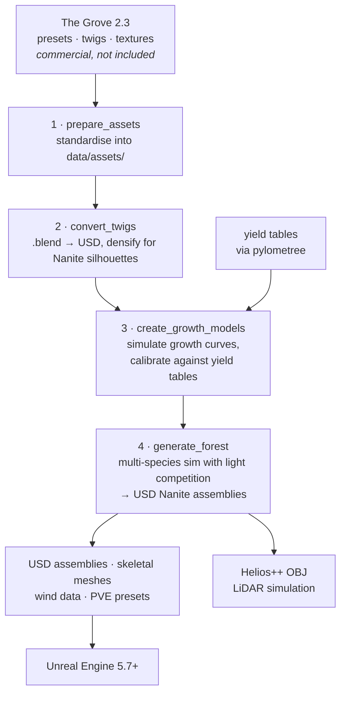

# growpy

Grow trees that are the right shape, at the right age, and cheap enough to put a forest of
them in VR.

[](https://doi.org/10.5281/zenodo.21509856)
[](https://www.gnu.org/licenses/agpl-3.0)

A field inventory gives you a species, a diameter and a height. A game engine needs a mesh
with a skeleton, foliage that reads as a canopy from 50 m, and a triangle budget. growpy
wraps [The Grove 2.3](https://www.thegrove3d.com)'s tree-growth simulation in a Python
pipeline that closes that gap — and calibrates the simulation against forestry yield tables,
so a tree labelled "beech, 25 m" has the trunk taper and crown a 25 m beech actually has,
not merely the height.

## What it does



Four levels of thing, which is worth holding in mind because the config is organised the
same way:

| Level | What it is |
|-------|-----------|
| **Forest** | A multi-species collection simulated together, with inter-tree light competition |
| **Grove** | One species' group inside that forest, sharing a growth model |
| **Tree** | An individual — mesh plus skeleton, so it can move in wind |
| **Twig** | A reusable USD foliage asset with a Nanite-optimised silhouette |

## Why it is built this way

- **The Grove, not a bespoke L-system.** Grove simulates growth — light response, shading,
  branch shedding, thickening — rather than generating a plausible-looking shape. That is
  what makes a calibrated 60-year-old beech differ from a scaled 20-year-old one in the ways
  a forester would notice. The cost is a commercial dependency that cannot be shipped.
- **Calibrated against yield tables, not tuned by eye.** Growth is aligned to published
  height and DBH curves through [`pylometree`](https://github.com/XRFutureForests/pylometree),
  so the dataset is defensible rather than decorative.
- **USD Nanite assemblies.** Foliage is the expensive part of a tree, and Nanite assembly
  cost scales with **part weight, not node count** — welding a smaller foliage variant took
  one library from 1,364 MB to 86 MB. Twigs are therefore separate, reusable, deduplicated
  assets rather than baked geometry.
- **Crown density is no longer corrected here.** It moved to the PVE side of the pipeline
  (2026-09-10): the acceptance metric is crown *structure*, and `crown_ratio` alone cannot
  see a hollow crown.

## The dataset

11 southern German species — 4 conifer, 7 broadleaf — chosen as the dominant trees of
Bavaria and Baden-Württemberg. Each species produces two exported individuals:

- **fid = 1** — open-grown, isolated, no light competition
- **fid = 2** — competition centre, surrounded by three equilateral-triangle neighbours

Neighbours (fid 101–103) take part in the simulation but are not exported. With density
variants active, each tree gets `full`, `reduced` and `bare` at every height milestone.

> **11 species is 10 distinct forms.** `norway_spruce` and `silver_fir` share a Grove preset,
> twig and texture set, so they produce identical geometry. That matters for any published
> species count.

Species catalogue and full specification: [docs/dataset/dataset-specification.md](docs/dataset/dataset-specification.md).

## Quick start

```bash
conda env create -f environment.yml
conda activate growpy
pip install -e .
growpy-init-config                     # optional: copy starter TOMLs to ./config

# add your licensed Grove installation
cp -r /path/to/the_grove_23 src/the_grove_23      # or mklink /D on Windows

python -c "import the_grove_23_core as gc; print('Grove API ready')"
```

**No separate Blender install is needed** — `bpy` comes through conda and brings USD (`pxr`)
with it.

The Grove is commercial software and is not in this repository. Everything else, including
the full pipeline, dataset production, Unreal import and troubleshooting, is in
**[RUNBOOK.md](RUNBOOK.md)**.

## Configuration

Every CLI reads defaults from `config/*.toml`, deep-merged in sorted order, with CLI
arguments overriding. Resolution order: dataclass defaults → `config/*.toml` → CLI.

| Section | Controls |
|---------|----------|
| `[general]` | Seed, default CSV, output directory, verbosity, profiling |
| `[assets]` | Grove installation path, texture resizing |
| `[twigs]` | Densification, alpha trimming, smoothing, interior decimation |
| `[growth_models]` | Simulation cycles, seeds, plateau detection, timeouts |
| `[calibration]` | Yield-table alignment for height and DBH, plot generation |
| `[yield_sources]` | Ingested yield-table store path, region filter |
| `[forest]` | Quality preset, growth-cycle limit, height interval, max height |
| `[quality.*]` | Named presets — mesh resolution, skeleton parameters |
| `[export]` | USD format, skeletal/static mesh, twig density, density variants |
| `[unreal]` | Import script generation, Unreal content path |
| `[helios]` | OBJ export, scene XML, mesh simplification |
| `[density_variant.*]` | Named density variants |

Species-to-asset mapping lives in `config/tree_asset_lookup.csv`; its `Dataset` column is
what selects the species the dataset pipeline produces.

## Repository layout

```
src/growpy/
├── cli/              # the four pipeline steps + dataset_pipeline
├── config/templates/ # packaged starter TOMLs (growpy-init-config copies these)
└── …                 # see docs/reference/module-reference.md
src/the_grove_23/     # your licensed Grove install — not tracked
config/               # user-editable TOMLs + tree_asset_lookup.csv
data/{input,assets,output}/
docs/                 # guides, reference, internals
tests/
```

## Documentation

| You want | Read |
|----------|------|
| Install, the four steps, dataset production, Unreal import, troubleshooting | [RUNBOOK.md](RUNBOOK.md) |
| CLI flags, configuration, module reference, USD builder, coordinate systems | [docs/reference/](docs/README.md) |
| Workflow guides — dataset, forest generation, PVE presets, Helios, Unreal | [docs/guides/](docs/README.md) |
| Nanite assembly internals, PVE JSON format | [docs/internals/](docs/README.md) |
| Why The Grove, why USD, the calibration record, Grove API analysis | XR Future Forests Lab knowledge hub — `04-LOGIC-TIER/growpy*`, `99-RESOURCES/vendor/the-grove/` |
| Contributing | [CONTRIBUTING.md](CONTRIBUTING.md) |
| Release history | [CHANGELOG.md](CHANGELOG.md) |

## License

Licensed under the
[GNU Affero General Public License v3.0 or later](https://www.gnu.org/licenses/agpl-3.0).
You are free to use, study, modify, and redistribute this software. If you run a modified
version on a server that users interact with over a network, you must make the modified
source available to those users. See [LICENSE](LICENSE).

The Grove 2.3 is commercial third-party software under its own licence and is not
distributed here.

## Citation

[](https://doi.org/10.5281/zenodo.21509856)

If you use growpy or its outputs in a publication, please cite it. See
[CITATION.cff](CITATION.cff) for machine-readable metadata, or:

> Sperlich, M. (2026). GrowPy: Procedural Forest Generation for Unreal Engine.
> University of Freiburg.
> https://github.com/XRFutureForests/growpy
