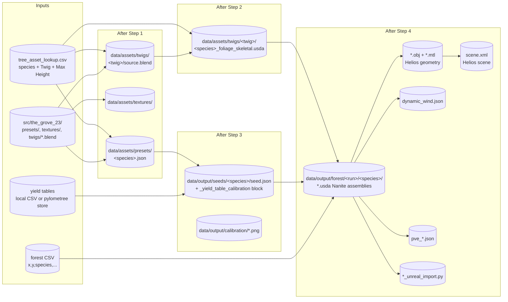

# Data Flow

This document describes the **data contracts** between pipeline steps — what
gets written by one step and read by the next, and what shape it has in
memory while step 4 is running.

## On-disk artefacts (the contract between steps)



## Forest CSV schema (input to step 4)

Required columns:

| Column | Type | Notes |
|---|---|---|
| `x`, `y` | float | Tree position in metres (Grove coordinate frame) |
| `species` | str | Standardised species name; must exist in `tree_asset_lookup.csv` |

Optional columns:

| Column | Type | Default | Notes |
|---|---|---|---|
| `z` | float | `0.0` | Vertical offset; populated by `core.forest.create_forest` if missing |
| `delay` | int | `0` | Cycles to wait before adding this tree to its grove (staggered planting) |
| `fid` | int | row index | Original feature ID, preserved through the pipeline so per-tree outputs can be matched back to source rows |
| `individual_type` | str | — | When present, trees are split into separate groves per `(species, individual_type)` to prevent intra-grove shade interfering between independent contexts (e.g. `open_grown` vs `surround`). A single-tree grove tagged `surround` gets Grove's Surround shell enabled. |
| `target_height_m`, `target_dbh_m` | float | — | If present, used by `calculate_growth_cycles_from_height()` to derive a per-tree `cycles` count |

## `seed.json` contract (the step 3 → step 4 handoff)

Step 3 writes a `seed.json` per species with the standard Grove structure
plus an extra `_yield_table_calibration` block:

```json
{
  "species": "Norway Spruce",
  "...": "...standard Grove preset fields...",
  "_yield_table_calibration": {
    "grow_length_per_cycle": [0.42, 0.51, ...],
    "thicken_tips_per_cycle": [0.0008, 0.0012, ...],
    "static_overrides": {
      "thicken_deadwood": 0.0,
      "grow_nodes": 4
    },
    "target_dbh_per_cycle": [0.01, 0.03, 0.06, ...],
    "height_dbh_model": {
      "type": "chapman_richards",
      "params": [0.85, 0.041, 1.7]
    }
  }
}
```

Loaded by [`config/preset_overrides.py`](../../src/growpy/config/preset_overrides.py)
through `load_curves_from_preset`, `load_target_dbh_from_preset`, and
`load_height_dbh_model_from_preset`. The result is a `PresetOverrides` object
that `core.forest.simulate_*` applies on every cycle.

## In-memory data structures during step 4

The single most important type in step 4 is `SnapshotData` (defined in
[`core/forest.py`](../../src/growpy/core/forest.py)):

```python
SnapshotData = Dict[
    int,                                                    # cycle index
    Dict[
        str,                                                # species name
        List[
            Tuple[Any, Any, Any, float, float]              # per-tree tuple:
            #     model, skeleton, bones_info, height, dbh
        ]
    ]
]
```

This is what `simulate_forest_growth_with_snapshots()` returns and what every
exporter in `io/` consumes. The five fields per tree:

| Field | Source | Used by |
|---|---|---|
| `model` | Grove `tree.model` (mesh data) | `tree_export.build_tree_mesh`, `obj_export` |
| `skeleton` | Grove `tree.skeleton` | `core.skeleton.build_skeleton_hierarchy`, `wind_json` |
| `bones_info` | Grove `tree.bones` flattened | `core.skeleton.get_bone_data_from_grove`, `assembly_export._extract_dynamic_wind_from_usd` |
| `height` (m) | `core.tree.calculate_tree_height` | export filenames, validation |
| `dbh` (m) | `core.tree.calculate_dbh_at_height` | radial scaling target in `tree_export.build_tree_mesh`, export filenames |

### Grove instance lifetime

Each grove returned by `create_forest` is **mutated in place** by the
simulation loop — the same `gc.Grove` object is the source of every snapshot
cycle. This means snapshots are not deep copies; the export pipeline must
finish using cycle N's tuples before the simulation advances to cycle N+1.
The current code does this by extracting all per-tree numpy arrays
immediately after each cycle.

## Output artefact layout

A single step-4 run with `dataset_pipeline.py --species "Norway Spruce"`
produces:

```
data/output/forest/<run_name>/
├── norway_spruce/
│   ├── norway_spruce_h12m_dbh28cm_skeletal.usda      # Nanite assembly
│   ├── norway_spruce_h12m_dbh28cm_static.usda        # static LOD
│   ├── norway_spruce_h12m_dbh28cm.obj                # Helios geometry
│   ├── norway_spruce_h12m_dbh28cm.mtl
│   ├── pve_norway_spruce.json                        # PVE preset
│   ├── dynamic_wind.json                             # Unreal wind config
│   └── twigs/                                        # bundled twig USDAs
│       └── norway_spruce_foliage.usda
├── scene.xml                                         # Helios scene (all species)
└── norway_spruce_unreal_import.py                    # Unreal import script
```

Filename formatting (`h12m_dbh28cm`) comes from
[`utils/export_naming.py`](../../src/growpy/utils/export_naming.py).

## Where the contracts are enforced

There is **no schema validation** between steps — they trust each other and
fail loudly if a file is missing. The closest thing to validation is:

- `step_runner.check_environment()` — checks `bpy` is importable before
  spawning any subprocess.
- `assembly_export.validate_assembly()` — post-write check that the USD
  matches the Nanite schema. Run inside step 4 itself.
- `dataset_csv_planner.synchronize_dataset_csvs()` — re-emits
  `all_species.csv` from per-species CSVs so they can't drift apart.

If you add a new field to the `seed.json` calibration block, the only place
it needs to be added is `config/preset_overrides.py`. There is no separate
schema file.
