# Module Dependency Graph

This is the static import graph of the `growpy` package, grouped by layer. Edges
show "imports from". Read top-to-bottom: each layer only depends on layers
below it (with one documented exception in `io/`, where some `io/pve_*` modules
import each other).

For an auto-generated version (pyreverse / pydeps output), see
[generated/](generated/).

## Layered view

```mermaid
flowchart TB
    classDef cli fill:#fde68a,stroke:#92400e,color:#000
    classDef orch fill:#fbcfe8,stroke:#9d174d,color:#000
    classDef core fill:#bbf7d0,stroke:#166534,color:#000
    classDef io fill:#bae6fd,stroke:#075985,color:#000
    classDef cfg fill:#e9d5ff,stroke:#6b21a8,color:#000
    classDef util fill:#e5e7eb,stroke:#374151,color:#000
    classDef ext fill:#fecaca,stroke:#991b1b,color:#000

    %% CLI layer
    DP[cli/dataset_pipeline]:::cli
    PA[cli/prepare_assets]:::cli
    CT[cli/convert_twigs]:::cli
    CGM[cli/create_growth_models]:::cli
    GF[cli/generate_forest]:::cli

    %% Orchestration
    CSVP[orchestration/dataset_csv_planner]:::orch
    JP[orchestration/dataset_job_planner]:::orch
    SR[orchestration/step_runner]:::orch

    %% Core
    Forest[core/forest]:::core
    Grove[core/grove]:::core
    Tree[core/tree]:::core
    Skel[core/skeleton]:::core
    Twig[core/twig]:::core

    %% IO
    AE[io/assembly_export]:::io
    TE[io/tree_export]:::io
    TWE[io/twig_export]:::io
    OBJ[io/obj_export]:::io
    HEL[io/helios_scene]:::io
    Wind[io/wind_json]:::io
    PVEMap[io/pve_grove_mapper]:::io
    PVEFol[io/pve_foliage_extractor]:::io
    PVEHier[io/pve_hierarchy_builder]:::io
    PVESch[io/pve_schema]:::io
    PVEDef[io/pve_growth_defaults]:::io
    Tex[io/texture_utils]:::io
    OV[io/overview]:::io
    US[io/unreal_scripts]:::io
    MS[io/mesh_simplify]:::io

    %% Config
    Cfg[config/core]:::cfg
    Paths[config/paths]:::cfg
    POv[config/preset_overrides]:::cfg
    PVEov[config/pve_species_overrides]:::cfg
    Q[config/quality]:::cfg

    %% Utils
    Log[utils/log]:::util
    Prof[utils/profiling]:::util
    An[utils/analysis]:::util
    YT[utils/yield_tables]:::util
    Plot[utils/plotting]:::util
    Pxr[utils/pxr_init]:::util
    Gbif[utils/gbif_species]:::util
    Nm[utils/naming]:::util
    EN[utils/export_naming]:::util

    %% External
    GC[the_grove_23_core]:::ext
    Bpy[bpy]:::ext
    Pylo[pylometree]:::ext

    %% CLI -> orchestration / core / io
    DP --> CSVP & JP & SR & OV & Log
    PA --> Tex & Gbif & Cfg & Paths & Log
    CT --> TWE & Tex & Pxr & Cfg & Paths & Log & Bpy
    CGM --> Grove & An & YT & POv & Cfg & Log & Pylo
    GF --> Forest & AE & OBJ & HEL & Wind & PVEMap & US & Q & POv & Tree & Cfg & Paths & Log & Prof & Bpy & GC

    %% Orchestration internals
    SR --> JP
    CSVP --> Nm & Cfg
    JP --> Nm & Cfg

    %% Core internals
    Forest --> Grove & Tree & POv & Log & GC
    Grove --> GC
    Tree --> Cfg & GC
    Skel --> Cfg
    Twig --> Cfg

    %% IO internals
    AE --> TE & Skel & Twig & Wind & EN & Q & Paths
    TE --> Skel & MS & Paths
    OBJ --> TE & Twig & Pxr & MS
    HEL --> Paths
    PVEMap --> PVEFol & PVEHier & PVESch & PVEDef & PVEov
    TWE --> Tex & MS & Pxr
    OV --> Paths

    %% Config internals
    POv --> Cfg & Paths
    Paths --> Cfg
    Q --> Cfg

    %% Utils internals
    An --> YT & Plot & GC
    YT --> Pylo
```

## Layer rules (the spine)

The package is structured as a strict layered architecture. From most
dependent to least dependent:

1. **`cli/`** — entry points. Allowed to import from anywhere below.
2. **`core/orchestration/`** — only imported by `cli/dataset_pipeline.py`.
   Imports from `config/`, `utils/`, and spawns subprocesses (no direct
   imports of `core/` simulation code, no `bpy`).
3. **`core/`** — pure simulation logic on top of `the_grove_23_core`. Imports
   `config/` and `utils/`. Does **not** import `io/`.
4. **`io/`** — every persistence concern (USD, OBJ, JSON, scripts, textures).
   Imports `core/`, `config/`, `utils/`. Some intra-`io/` imports for the PVE
   submodules.
5. **`config/`** — pure config loading and resolution. Imports only `utils/`.
6. **`utils/`** — leaf modules. No intra-package imports above this level.

**Hot rule for new code:** if you find yourself wanting to import `io/` from
`core/`, you have probably mixed simulation and serialisation — split the
function instead. The cleanest tell is `core/skeleton.py` and `core/twig.py`,
which deliberately contain *only* the math, while the corresponding USD
serialisation lives in `io/assembly_export.py`.

## Spine of the pipeline (most-imported modules)

These are the modules touched by most other modules — changes here ripple
widely, so review them carefully:

| Module | Imported by |
|---|---|
| `config/core.py` (`get_config`) | every CLI script + most `core/`/`io/` modules |
| `config/paths.py` | most `io/` modules, `config/preset_overrides`, `core/skeleton`, `core/twig` |
| `utils/log.py` | every CLI script |
| `core/forest.py` | `cli/generate_forest.py` (single consumer, but transitively pulls in everything in `core/`) |
| `io/assembly_export.py` | `cli/generate_forest.py` (entry point for the entire export tree) |
| `io/tree_export.py` | `io/assembly_export.py`, `io/obj_export.py` (shared mesh + radial scaling) |

## Modules that touch external systems

| Module | External system | Notes |
|---|---|---|
| `cli/convert_twigs.py`, `io/twig_export.py` | `bpy` (Blender) | Step 2 only |
| `cli/generate_forest.py`, `core/forest.py`, `core/grove.py`, `core/tree.py` | `bpy`, `the_grove_23_core` | Step 4 only |
| `cli/create_growth_models.py`, `utils/yield_tables.py` | `pylometree` (yield tables) | Step 3 only |
| `io/assembly_export.py`, `io/tree_export.py`, `io/twig_export.py`, `io/obj_export.py` | `pxr` (USD) via `utils/pxr_init.py` | Anywhere USD is written |
| `io/unreal_scripts.py`, `io/ue_remote.py`, `cli/ue_exec.py` | Unreal Engine (file-drop and remote-control) | Post-export only |

## When the layered view doesn't match reality

A few intentional exceptions:

- `io/pve_*` modules import each other (`pve_grove_mapper` is the public face,
  the other four are its private collaborators). Treat them as a single
  sub-package.
- `cli/generate_forest.py` is unusually large because it owns the entire
  step-4 control flow. It is the *only* place outside `core/` that calls
  `the_grove_23_core` directly.
- `core/forest.py` imports `tqdm` for progress bars — that's a UI concern in a
  "pure" layer, but it's been kept there because the simulation loop is the
  natural place to report progress.

If you discover a new exception while editing, add it here so the next reader
isn't surprised.
