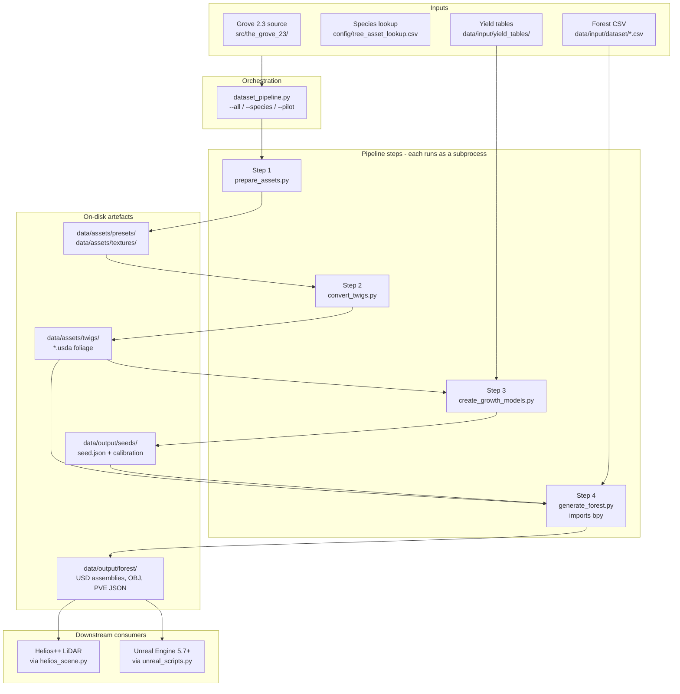
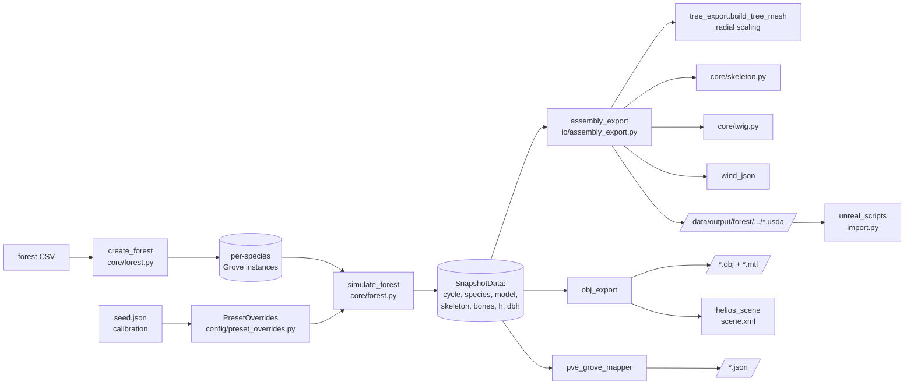
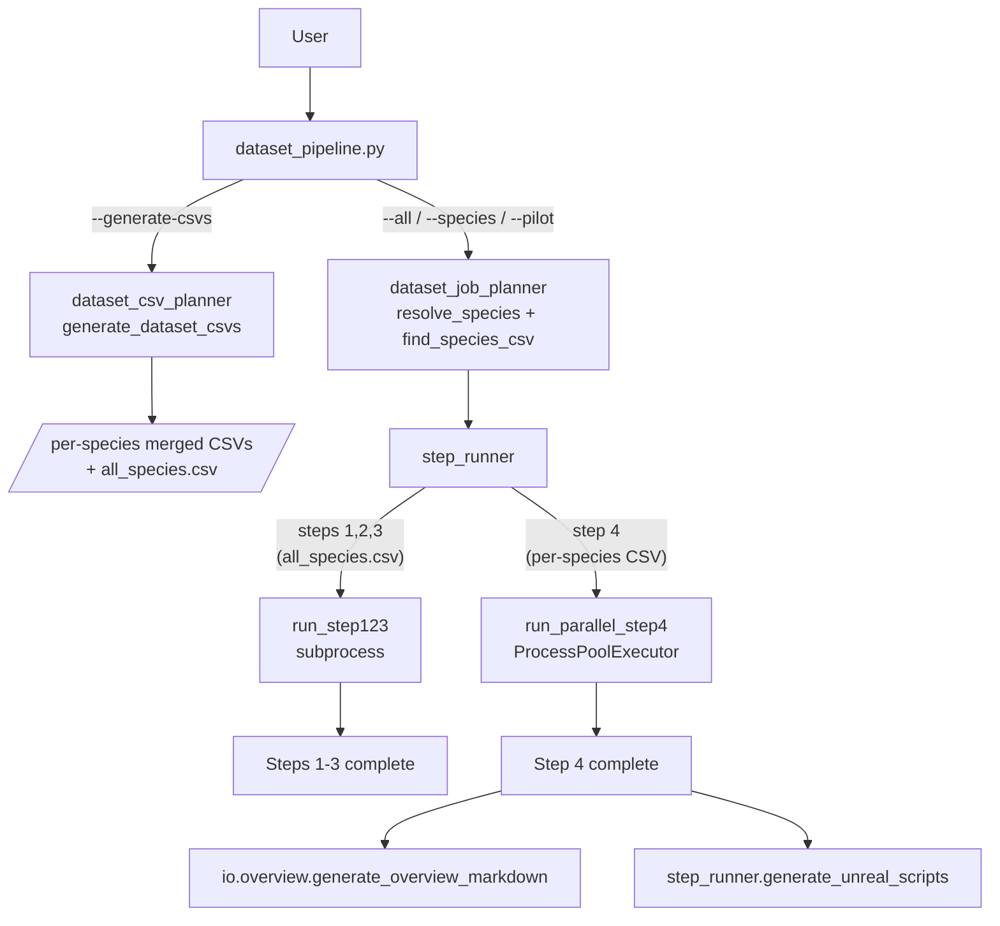

# Pipeline Overview

GrowPy turns species/position CSVs into Unreal-Engine-ready USD forests by
running a fixed 4-step pipeline. Step 4 (forest generation) imports `bpy`
(Blender Python), so it always runs in a subprocess — the orchestrator
([`dataset_pipeline.py`](../../src/growpy/cli/dataset_pipeline.py)) keeps `bpy`
out of its own process by invoking every step as a subprocess for consistency.

## End-to-end flow

## What each step does

### Step 1 — `cli/prepare_assets.py`

**Purpose:** Mirror the Grove 2.3 source tree into `data/assets/` in a
predictable layout, normalising species names along the way.

| | |
|---|---|
| **Reads** | `src/the_grove_23/presets/`, `src/the_grove_23/textures/`, `config/tree_asset_lookup.csv` |
| **Writes** | `data/assets/presets/<species>.json`, `data/assets/textures/`, `data/assets/twigs/<twig_name>/` (empty dirs ready for step 2) |
| **Key calls** | `utils.gbif_species` (name standardisation), `io.texture_utils` (texture copy/normalise) |
| **CLI entry** | `growpy-prepare-assets` |

The species → twig mapping in the lookup CSV is what allows multiple species to
share the same Grove twig geometry (e.g. Norway spruce uses
`PacificSilverFirTwig`).

### Step 2 — `cli/convert_twigs.py`

**Purpose:** Run inside Blender (via `bpy`) to load each Grove `.blend` twig
file and export it as a `.usda` foliage mesh that USD can consume.

| | |
|---|---|
| **Reads** | `data/assets/twigs/<twig_name>/source.blend`, plus the `Twig` column from `tree_asset_lookup.csv` to build the species→twig map |
| **Writes** | `data/assets/twigs/<twig_name>/<species>_foliage_skeletal.usda` (named after the *species*, not the donor twig) |
| **Key calls** | `io.twig_export.process_twig_file()`, `io.texture_utils`, `utils.pxr_init` (USD plugin path) |
| **CLI entry** | `growpy-convert-twigs` |

`twig_export.py` is the heart of this step — it does the tube/plane topology
classification described in `MEMORY.md` so leaf/needle planes survive
decimation but stem cylinders get reduced.

### Step 3 — `cli/create_growth_models.py`

**Purpose:** Simulate uncalibrated Grove growth for each species, fit it
against yield-table reference data, store calibration coefficients, and
re-simulate to produce the final per-cycle prediction model.

| | |
|---|---|
| **Reads** | `data/assets/presets/`, yield tables (local CSV or `pylometree` store), `growpy.toml [calibration]` |
| **Writes** | `data/output/seeds/<species>/seed.json` (with `_yield_table_calibration` block), calibration plots in `data/output/calibration/` |
| **Key calls** | `core.grove.create_grove`, `utils.analysis.SpeciesGrowthAnalyzer`, `utils.yield_tables` (Chapman-Richards interpolation), `utils.plotting` |
| **CLI entry** | `growpy-create-models` |

The calibration coefficients written here are read back by
[`config/preset_overrides.py`](../../src/growpy/config/preset_overrides.py)
during step 4 — that is the only handoff between step 3 and step 4.

### Step 4 — `cli/generate_forest.py`

**Purpose:** Read a forest CSV (positions + species), grow a Grove for each
species applying calibration overrides, and export USD/OBJ/PVE artefacts.

| | |
|---|---|
| **Reads** | Forest CSV, `data/assets/twigs/.../foliage_skeletal.usda`, `data/output/seeds/<species>/seed.json` (calibration), `growpy.toml [quality.<preset>]` |
| **Writes** | `data/output/forest/<run>/<species>/*.usda` (Nanite assemblies), `*.obj`/`*.mtl` (Helios), `*.json` (PVE), `dynamic_wind.json`, Unreal import script |
| **Key calls** | `core.forest.create_forest`, `core.forest.simulate_forest`, `io.assembly_export.export_nanite_assembly`, `io.tree_export.build_tree_mesh` (radial scaling), `io.obj_export`, `io.helios_scene`, `io.wind_json`, `io.pve_grove_mapper`, `io.unreal_scripts` |
| **CLI entry** | `growpy-generate-forest` |

This step is the only one that imports `bpy` and `the_grove_23_core`, and is
the only step that's parallelised (one subprocess per species via
`step_runner.run_parallel_step4`).

## Inside Step 4 — generation order

## Dataset orchestration (multiple species)

`dataset_pipeline.py` itself does **no Python work** other than argument
parsing and calling into the three orchestration helpers in
`core/orchestration/`. All actual file I/O happens in the step scripts that it
spawns as subprocesses. This is what makes it safe to run from a shell that
doesn't have `bpy` available — only the spawned step-4 subprocess imports it.

## Where to plug in changes

| If you want to… | Edit this |
|---|---|
| Add a new species | `config/tree_asset_lookup.csv` (+ optional yield-table CSV) |
| Change calibration math | `utils/yield_tables.py` + `config/preset_overrides.py` |
| Change USD layout | `io/assembly_export.py` (+ `core/skeleton.py`, `core/twig.py`) |
| Change radial scaling / DBH targeting | `io/tree_export.build_tree_mesh` |
| Change quality presets / LOD ratios | `growpy.toml [quality.*]` |
| Change Helios export | `io/obj_export.py`, `io/helios_scene.py` |
| Change PVE mapping for Unreal | `io/pve_grove_mapper.py` |
| Add a new pipeline step | Add CLI script + register in `step_runner.STEP_SCRIPTS` + add to `pyproject.toml [project.scripts]` |
| Change dataset planning logic | `core/orchestration/dataset_*_planner.py` |

For the per-module function/class reference, see
[module-reference.md](module-reference.md).
