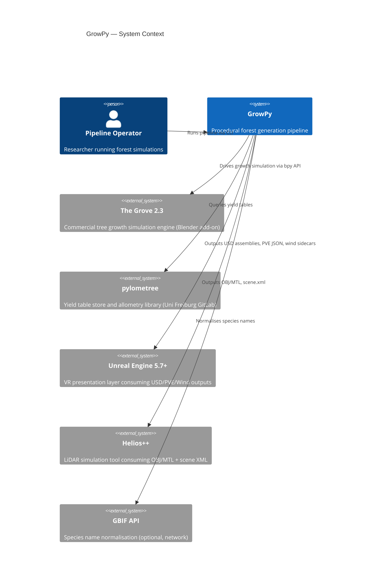
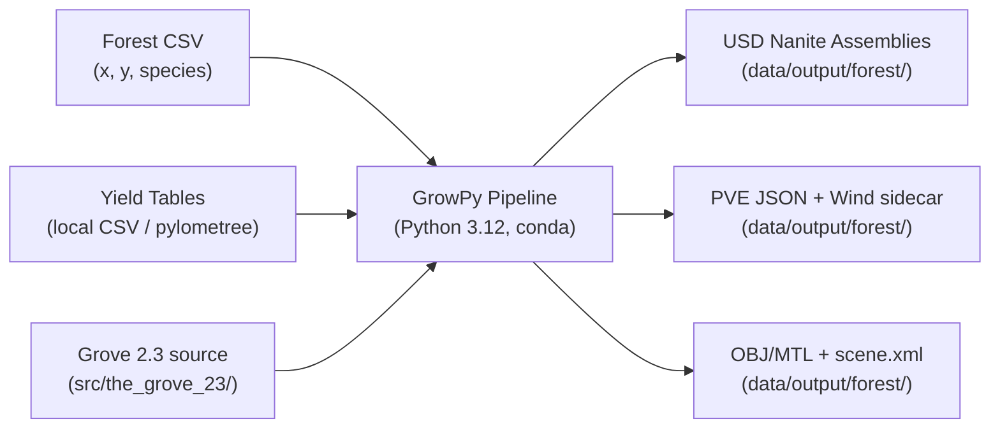
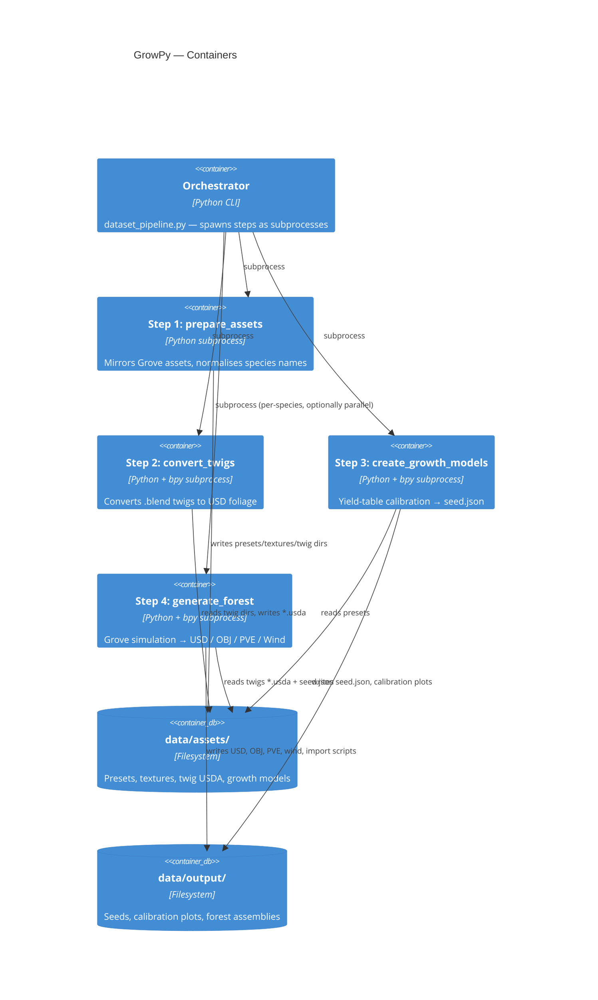
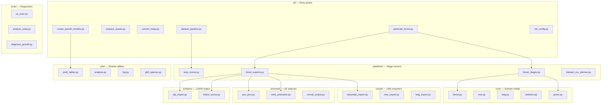
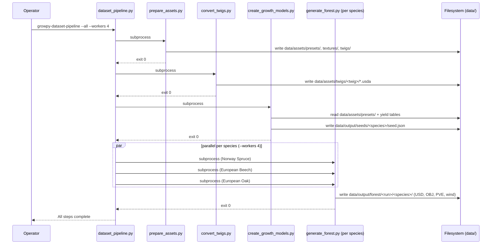
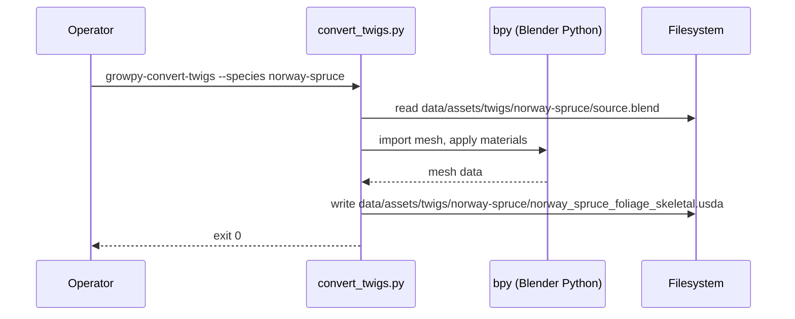
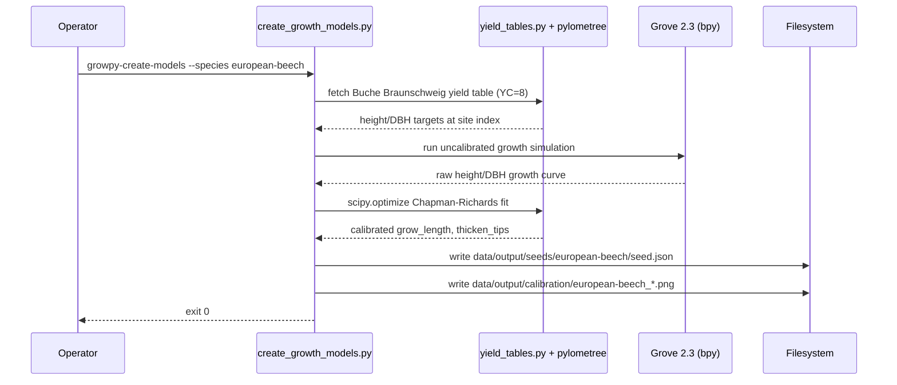

# Software Architecture Document: GrowPy

**Document Version:** 1.0
**Date:** 2026-05-11
**Status:** Active
**Architecture Framework:** arc42 (simplified)
**Standard Compliance:** ISO/IEC/IEEE 42010:2022

<!-- SCOPE: System architecture (arc42 structure), C4 diagrams (Context, Container, Component), runtime scenarios (sequence diagrams), crosscutting concepts, ADR references ONLY. -->
<!-- DOC_KIND: explanation -->
<!-- DOC_ROLE: canonical -->
<!-- READ_WHEN: Read when you need the system model, pipeline boundaries, runtime flow, or design rationale. -->
<!-- SKIP_WHEN: Skip when you only need CLI flags, module internals, or output format specs. -->
<!-- PRIMARY_SOURCES: docs/project/requirements.md, docs/project/tech_stack.md, docs/architecture/pipeline-overview.md -->

<!-- NO_CODE_EXAMPLES: Architecture documentation describes DECISIONS and CONTRACTS, not implementations.
     FORBIDDEN: Import statements, function bodies, code blocks > 5 lines
     ALLOWED: Component responsibility tables, Mermaid diagrams, method signatures (1 line), doc links
     For implementation details → docs/architecture/module-reference.md -->

## Quick Navigation

- [Docs Hub](../README.md)
- [Requirements](requirements.md)
- [Tech Stack](tech_stack.md)
- [Pipeline Overview](../architecture/pipeline-overview.md)
- [Module Reference](../architecture/module-reference.md)
- [Data Flow](../architecture/data-flow.md)

## Agent Entry

| Signal | Value |
|--------|-------|
| Purpose | Explains system structure, pipeline boundaries, runtime behaviour, and architectural decisions. |
| Read When | You need mental models, component boundaries, data-flow contracts, or cross-cutting concerns. |
| Skip When | You only need CLI flags, exact module APIs, or deployment commands. |
| Canonical | Yes |
| Next Docs | [Requirements](requirements.md), [Tech Stack](tech_stack.md), [Pipeline Overview](../architecture/pipeline-overview.md) |
| Primary Sources | `docs/project/requirements.md`, `docs/project/tech_stack.md`, `docs/architecture/pipeline-overview.md` |

---

## 1. Introduction and Goals

### 1.1 Requirements Overview

GrowPy converts forest field-measurement data (species, XY position, optional target dimensions) into photorealistic USD forest assemblies for Unreal Engine 5.7+ and OBJ/XML scene files for Helios++ LiDAR simulation. The pipeline runs in four discrete steps, each as an isolated subprocess, with The Grove 2.3 providing the tree growth simulation engine.

See [requirements.md](requirements.md) for the full functional requirements catalogue.

### 1.2 Quality Goals

| Priority | Goal | Measure |
|----------|------|---------|
| 1 | Calibration accuracy | Simulated height/DBH within ±10% of yield table targets at site index |
| 2 | Output compatibility | USD assemblies import into UE 5.7+ Nanite without errors; OBJ/XML accepted by Helios++ unmodified |
| 3 | Reproducibility | Same inputs + same `seed.json` produce identical outputs across runs |
| 4 | Maintainability | Each pipeline step is independently runnable and testable as a subprocess |
| 5 | Extensibility | New species added by adding a row to `tree_asset_lookup.csv` and a matching Grove preset |

### 1.3 Stakeholders

| Stakeholder | Concern |
|-------------|---------|
| XR Future Forests Lab (Uni Freiburg) | Research-grade forest simulation, Eva Mayr-Stihl Stiftung funded project |
| Pipeline Operators | Reliable end-to-end runs, clear error messages, reproducible outputs |
| UE Integration Engineers | Valid Nanite-compatible USD, correct PVE JSON and wind sidecars |
| LiDAR Analysts | Standard OBJ/MTL geometry + valid Helios++ scene XML |

---

## 2. Constraints

### 2.1 Technical Constraints

| Constraint | Implication |
|------------|-------------|
| The Grove 2.3 (commercial, `bpy`-based) | Steps that drive Grove must run inside a `bpy`-enabled subprocess; the orchestrator never imports `bpy` |
| `usd-core ≥23.11` | USD layer-based instancing required for Nanite-compatible assembly structure |
| Python 3.12 / conda `growpy` env | All scripts must be invoked within this environment |
| Local filesystem only | No network storage; all paths relative to project root |
| AGPL-3.0-or-later license | Grove presets not redistributed (separate commercial license) |

### 2.2 Organizational Constraints

- Team: Small research group (1–3 developers), XR Future Forests Lab, Uni Freiburg
- Process: Linear-tracked issues; no formal sprint cadence
- Compliance: AGPL-3.0-or-later; Grove commercial licence per user

### 2.3 Conventions

| Area | Convention |
|------|-----------|
| Code style | Black (88-char line length), ruff linting |
| File naming | Snake-case Python modules; kebab-case docs |
| Species names | Standardised via GBIF lookup; overrides in `config/tree_asset_lookup.csv` |
| Coordinate frame | Grove/Blender: Z-up, metres; UE: Z-up, cm (conversion handled in USD exporter) |
| Output versioning | Run outputs keyed by `<run>` directory name; no automatic versioning |

---

## 3. Context and Scope

### 3.1 Business Context

GrowPy sits between field-measurement data and real-time 3D presentation layers in the XR Future Forests Lab digital twin pipeline.



**External Interfaces:**

| System | Direction | Protocol | Purpose |
|--------|-----------|----------|---------|
| The Grove 2.3 | In-process (subprocess) | `bpy` Python API | Tree geometry + skeleton generation |
| `pylometree` | In-process | Python import | Yield table retrieval, Chapman-Richards fitting |
| GBIF API | Outbound (optional) | HTTPS REST | Species name normalisation |
| Unreal Engine 5.7+ | File handoff | USD, JSON | Nanite assembly import, PVE, wind animation |
| Helios++ | File handoff | OBJ/MTL, XML | LiDAR point-cloud simulation |

### 3.2 Technical Context



---

## 4. Solution Strategy

### 4.1 Technology Decisions

| Decision | Choice | Rationale |
|----------|--------|-----------|
| Tree simulation engine | The Grove 2.3 via `bpy` | Only tool producing botanically realistic procedural trees with skeleton/wind support |
| Growth calibration | Chapman-Richards + `scipy.optimize` | Standard forestry growth model; parsimonious (3–4 params) |
| Output format (UE) | USD (`.usda`) with Nanite assembly structure | Native UE 5 Nanite pipeline; layer-based instancing minimises file size |
| Output format (LiDAR) | OBJ/MTL + Helios++ scene XML | Helios++ native input format |
| Subprocess isolation | Each step runs as a separate subprocess | Prevents `bpy` (Blender) from contaminating the orchestrator's import namespace |
| Config format | TOML | Human-readable, supports nested overrides, native Python support via `tomllib` |

### 4.2 Top-Level Decomposition

The pipeline follows a **staged batch architecture**: four ordered steps, each a standalone script that reads from and writes to a well-defined directory contract. No in-memory state passes between steps — all handoffs are on-disk artefacts (see `docs/architecture/data-flow.md`).

```
CLI (thin argparse wrappers)
  └─ Orchestrator (dataset_pipeline.py)
       ├─ Step 1: prepare_assets.py    → data/assets/
       ├─ Step 2: convert_twigs.py     → data/assets/twigs/
       ├─ Step 3: create_growth_models.py → data/output/seeds/
       └─ Step 4: generate_forest.py   → data/output/forest/
```

### 4.3 Approach to Quality Goals

| Quality Goal | Approach |
|--------------|----------|
| Calibration accuracy | Iterative `scipy.optimize` fitting; calibration diagnostic plots generated automatically |
| Output compatibility | USD exporter enforces Nanite-required prim structure; Helios XML validated against schema |
| Reproducibility | `seed.json` captures all Grove parameters deterministically; steps are idempotent with `--force` |
| Maintainability | Each step has a single entry-point function; subprocess boundary enforces interface discipline |
| Extensibility | Species table (`tree_asset_lookup.csv`) is the sole registry; new species require no code changes |

---

## 5. Building Block View

### 5.1 Level 1: System Context (C4)

See Section 3.1 for the Context diagram. GrowPy is a single deployable Python package with no external network services of its own.

### 5.2 Level 2: Container Diagram (C4)



### 5.3 Level 3: Component Diagram (C4)

**Source package `src/growpy/` — component groups:**



**Key Components:**

| Component | Package | Responsibility |
|-----------|---------|----------------|
| `dataset_pipeline.py` | `cli/` | Top-level orchestrator; spawns all steps as subprocesses |
| `forest.py` | `core/` | Forest domain model; manages inter-tree light competition |
| `grove.py` | `core/` | Grove API wrapper; drives The Grove 2.3 growth simulation |
| `step_runner.py` | `pipelines/` | Subprocess runner with env validation and exit-code handling |
| `forest_stages.py` | `pipelines/` | Per-step algorithm logic extracted from `generate_forest.py` |
| `assembly_export.py` | `io/usd/` | Composes USD Nanite assemblies from per-tree USD layers |
| `helios_scene.py` | `io/helios/` | Emits Helios++ scene XML referencing exported OBJ geometry |
| `yield_tables.py` | `utils/` | Chapman-Richards fitting against `pylometree` yield data |

---

## 6. Runtime View

### 6.1 Scenario: Full Dataset Run (`growpy-dataset-pipeline --all`)



### 6.2 Scenario: Single-Step Twig Conversion



### 6.3 Scenario: Growth Model Calibration



---

## 7. Crosscutting Concepts

### 7.1 Subprocess Isolation

The orchestrator never imports `bpy`. Every step is a separate subprocess. This:
- Prevents Blender's import side-effects from polluting the orchestrator
- Allows parallel execution via `joblib` without GIL contention
- Makes each step independently testable and re-runnable

See: `pipelines/step_runner.py`

### 7.2 Error Handling

- Each step exits with a non-zero code on failure; the orchestrator propagates this.
- Errors are logged with `utils/log.py` before raising.
- Calibration failures fall back to a default `grow_length` and log a warning (non-fatal).
- USD export errors are fatal; partial output directories are left for inspection.

### 7.3 Configuration Management

- All config lives in the `config/*.toml` files (project root), scaffolded by `growpy-init-config`.
- Per-species overrides in `config/` TOML fragments merge over base config.
- No hardcoded paths; all paths resolved relative to project root via `config/paths.py`.
- Secrets: none (no credentials required; Grove licence is a local file).

### 7.4 Data Access Pattern

Steps communicate exclusively through the filesystem (on-disk artefact contracts). There is no shared in-memory state between steps. The contract is defined in `docs/architecture/data-flow.md` and must be treated as a stable interface. Breaking changes require updating both the producing step and all consuming steps.

### 7.5 Coordinate System Handling

| System | Frame | Unit |
|--------|-------|------|
| Forest CSV / Grove | Z-up, right-handed | metres |
| Blender | Z-up, right-handed | metres |
| USD (exported) | Y-up, right-handed | metres |
| Unreal Engine | Z-up, left-handed | centimetres |

Conversions are applied in the USD and OBJ exporters. See `docs/reference/coordinate-systems.md`.

---

## 8. Architecture Decisions (ADRs)

No formal ADR directory exists at `docs/reference/adrs/` at time of writing. Key implicit decisions recorded here:

| Decision | Choice | Rationale |
|----------|--------|-----------|
| Subprocess isolation for `bpy` | Each step as subprocess | Prevents Blender import pollution; enables parallel step-4 |
| Chapman-Richards calibration model | `scipy.optimize` + 3-param fit | Standard forestry model; validated in literature (see `docs/reference/yield-table-calibration.md`) |
| USD as primary 3D exchange format | USD `.usda` with layer instancing | Native UE 5 Nanite pipeline; best geometry compression |
| TOML for configuration | `config/*.toml` (deep-merged) | Human-readable, supports nested keys, no additional deps |
| On-disk artefact contracts between steps | Filesystem-only handoff | Decouples steps, enables resume after failure, simplifies testing |

---

## 9. Quality Requirements

### 9.1 Quality Tree

| Attribute | Goal | Verification |
|-----------|------|-------------|
| Calibration accuracy | Height/DBH within ±10% of yield table at site index | Calibration plots in `data/output/calibration/` |
| Output compatibility | UE 5.7+ Nanite import without errors | Manual UE import test; Helios++ scene validation |
| Reproducibility | Identical outputs for same inputs + `seed.json` | Deterministic Grove seed + no random state outside calibration |
| Step independence | Any single step runnable in isolation | Each step has a standalone `main()` entry point |
| Extensibility | New species: CSV row + preset only | `tree_asset_lookup.csv` as sole registry |

### 9.2 Quality Scenarios

| ID | Attribute | Stimulus | Response |
|----|-----------|----------|----------|
| QS-1 | Calibration accuracy | Run Step 3 on Norway Spruce (YC=12) | `seed.json` height within ±10% of Fichte Bayern table at age 80 |
| QS-2 | Output compatibility | Import USD assembly in UE 5.7+ with Nanite | No import errors; mesh renders with Nanite enabled |
| QS-3 | Reproducibility | Re-run Step 4 with same CSV + seed.json | Byte-identical USD output |
| QS-4 | Error isolation | Step 3 fails for one species | Orchestrator logs failure, skips to next species, exits non-zero |

---

## 10. Risks and Technical Debt

### 10.1 Known Technical Risks

| Risk | Impact | Likelihood |
|------|--------|-----------|
| The Grove 2.3 API changes in a future version | High — all `core/grove.py` bindings break | Low (commercial tool, stable API) |
| `bpy` bundling breaks on Python version update | Medium — Steps 2/4 fail to import | Medium |
| Yield table coverage limited to 3 species | Medium — pipeline only supports Norway Spruce, European Beech, European Oak | Known limitation |
| No automated regression testing for USD output | Medium — geometry regressions go undetected | Medium |

### 10.2 Technical Debt

| Item | Risk | Planned Resolution |
|------|------|--------------------|
| No formal ADR directory | Low — decisions undocumented | Create `docs/reference/adrs/` as issues are tracked in Linear |
| `pyproject.toml` dependency versions pinned loosely | Low — `numpy>=1.20` may pull incompatible version | Pin to tested ranges in `environment.yml` |
| Silver fir removed (shares Grove preset with Norway Spruce) | Medium — incomplete species coverage | Requires custom Grove preset for silver fir |

### 10.3 Mitigation Strategies

- Pin `bpy` and `usd-core` to exact versions in `environment.yml`; test upgrades on a branch before merging.
- Add a smoke-test step that validates USD structure after Step 4 using `usd-core`'s validation API.
- Expand yield table coverage by adding new national tables to `pylometree`.

---

## 11. Glossary

| Term | Definition |
|------|------------|
| Forest | Multi-species tree collection with inter-tree light competition |
| Grove | Species-specific tree group sharing one calibrated growth model (Grove 2.3 concept) |
| Tree | Individual tree instance with mesh + skeleton for wind animation |
| Twig | Reusable USD foliage asset (leaves/needles) with Nanite-optimised silhouettes |
| YieldTable | German national forestry yield table providing height/DBH targets at a given site index |
| Seed JSON | Per-species Grove parameter file produced by Step 3; the Step 3 → Step 4 handoff contract |
| Nanite | Unreal Engine 5 virtualised geometry system |
| PVE | Procedural Vegetation Editor — UE 5 subsystem consuming `pve_*.json` sidecars |
| DBH | Diameter at Breast Height (1.3 m) |
| Chapman-Richards | Sigmoidal biological growth function used for height/DBH curve fitting |
| Site Index | Relative forest site productivity, used to select the correct yield table column |
| bpy | Blender's Python API; required for Grove simulation and `.blend` → USD conversion |
| Container (C4) | Deployable/runnable unit — here, each pipeline step subprocess |
| Component (C4) | Logical grouping of related source modules within a container |

---

## 12. References

1. arc42 Architecture Template v8.2 — https://arc42.org/
2. C4 Model for Visualizing Software Architecture — https://c4model.com/
3. ISO/IEC/IEEE 42010:2022 — Architecture description
4. GrowPy Requirements: [docs/project/requirements.md](requirements.md)
5. GrowPy Pipeline Overview: [docs/architecture/pipeline-overview.md](../architecture/pipeline-overview.md)
6. GrowPy Data Flow Contracts: [docs/architecture/data-flow.md](../architecture/data-flow.md)
7. GrowPy Module Reference: [docs/architecture/module-reference.md](../architecture/module-reference.md)
8. Yield Table Calibration: [docs/reference/yield-table-calibration.md](../reference/yield-table-calibration.md)
9. Coordinate Systems: [docs/reference/coordinate-systems.md](../reference/coordinate-systems.md)

---

## Maintenance

**Last Updated:** 2026-05-11

**Update Triggers:**
- New pipeline steps added or step responsibilities change
- New downstream consumer beyond UE/Helios++
- Changes to on-disk artefact contracts between steps
- New species requiring Grove preset additions
- ADR directory created at `docs/reference/adrs/`

**Verification:**
- [x] C4 Context, Container, and Component diagrams consistent with source structure
- [x] Runtime scenarios cover main pipeline paths
- [x] All external systems documented in Section 3
- [x] No unreplaced template markers
- [x] Coordinate system table matches `docs/reference/coordinate-systems.md`

---

## Revision History

| Version | Date | Author | Changes |
|---------|------|--------|---------|
| 1.0 | 2026-05-11 | ln-112-project-core-creator | Initial version |
