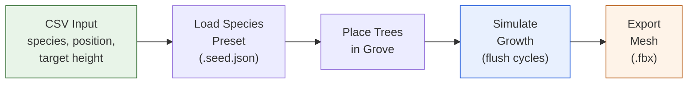
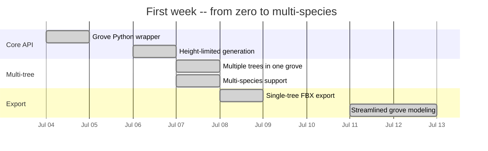

# GrowPy Project Kickoff -- First Trees from Code

**Automating tree generation with The Grove's Python API**

---

## The problem

Creating realistic 3D tree assets for virtual forest environments is slow and
manual. Each species needs careful modeling of branching patterns, crown shape,
and growth habit. For a forest simulation with multiple species at different
ages and sizes, this quickly becomes unmanageable.

## The idea

Use The Grove -- a commercial procedural tree modeling tool built on botanical
growth algorithms -- and drive it entirely from Python. Instead of manually
tweaking parameters in a GUI, we define species configurations in CSV files
and let GrowPy handle the simulation, mesh generation, and export.

## First week: from zero to multi-species

Within the first week (Jul 4--12, 2025), the project went from an empty repository
to growing multiple species in a single simulation:

- **Day 1**: Initial Python module wrapping The Grove's core API
- **Day 3**: First working tree generation with configurable height limits
- **Day 4**: Multiple trees in a single grove, multi-species support
- **Day 5**: Single-tree FBX export working
- **Day 8**: Streamlined grove modeling with documentation

The core loop is simple: load a species preset, place trees at coordinates from
a CSV file, simulate growth for a given number of flush cycles, then export
the resulting mesh.

## Key design decisions

- **CSV-driven input**: Tree positions, species, and target heights defined in
  simple CSV files -- no GUI interaction needed
- **Species presets**: Each species maps to a Grove `.seed.json` preset file that
  encodes branching behavior, growth rates, and crown geometry
- **Python-first**: Everything runs from the command line via conda, making it
  reproducible and scriptable

## What this enables

With the Grove API automated, we can now batch-produce tree meshes at scale.
The next steps are improving export quality (LOD levels, textures, skeletons)
and targeting Unreal Engine 5's Nanite system for efficient rendering of
dense forest scenes.

---

*GrowPy -- procedural tree generation for virtual forest environments.*
