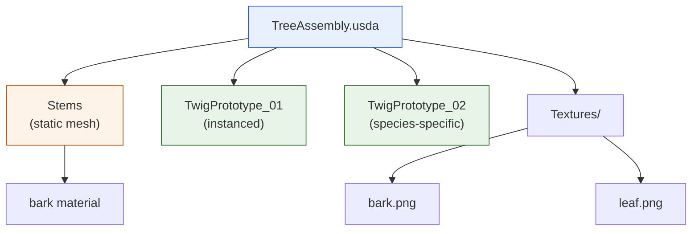
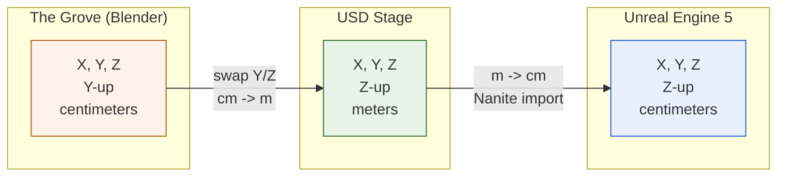

# Nanite Assembly Export -- USD Pipeline for Unreal Engine 5

**First successful import of procedural trees into UE5 Nanite**

---

## The challenge

Unreal Engine 5's Nanite virtualized geometry system can render billions of
triangles efficiently, but it has strict requirements for how meshes are
structured. Getting procedurally generated trees from The Grove into Nanite
requires a carefully constructed USD scene hierarchy with correct coordinate
systems, material assignments, and metadata.

## What we built

Over a concentrated push in early October 2025, we implemented a complete
USD export pipeline targeting Nanite Assembly -- Unreal's method for composing
complex objects from multiple mesh parts:

- **Y-up to Z-up coordinate transformation**: The Grove works in Blender's Y-up
  space; Unreal expects Z-up. Every vertex, normal, and twig placement gets
  converted.
- **Species-specific directory structure**: Each species exports into its own
  folder with stems, twigs, textures, and assembly files.
- **Twig instancing**: Rather than duplicating twig geometry for every attachment
  point, we export twig prototypes once and use USD instancing to place thousands
  of copies efficiently.
- **Stage metadata**: Proper `metersPerUnit`, `upAxis`, and Unreal schema
  references so the UE5 importer interprets the file correctly.

## The Nanite Assembly structure

Each tree variant produces a USD assembly file that references:

Unreal imports this as a single Nanite-enabled static mesh with automatic LOD
generation -- no manual mesh optimization needed.

## Coordinate system headaches

The biggest debugging effort was getting coordinate conversions right.

Every transform in the pipeline -- vertex positions,
normals, twig rotations, bone transforms -- needs consistent conversion. A single
missed transform creates invisible twigs, flipped branches, or trees growing
sideways.

> **Screenshot placeholder** -- side-by-side comparison of a tree in Blender
> viewport (Y-up) and the same tree imported in UE5 (Z-up) showing correct
> coordinate conversion.

<!-- TODO: add screenshot from UE5 Nanite viewport showing imported tree -->

## Result

Trees generated by GrowPy now import cleanly into UE5 as Nanite meshes with
correct geometry, materials, and twig placement. This is the foundation for
building large-scale forest scenes directly from simulation output.

---

*GrowPy -- procedural tree generation for virtual forest environments.*
