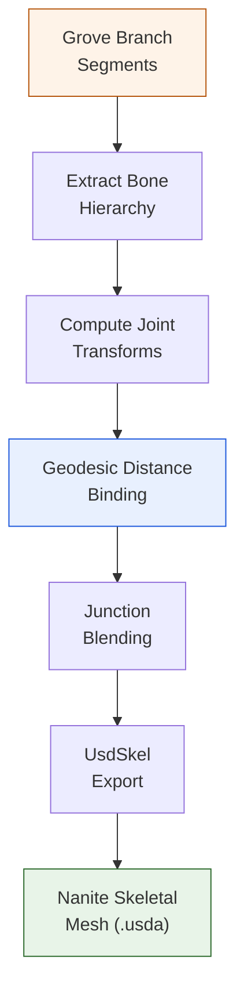
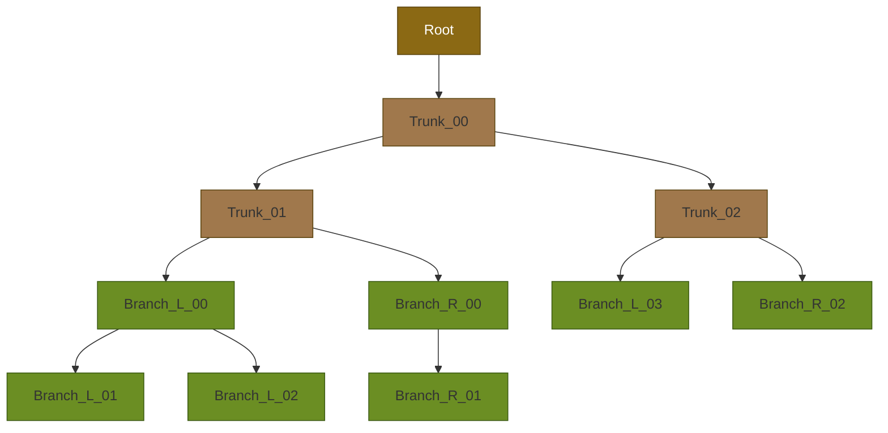

# Skeletal Mesh Pipeline -- Animated Trees for Unreal Engine

**Wind-responsive tree skeletons from procedural growth simulation**

---

## Why skeletons matter

Static Nanite meshes look great but feel lifeless. For a convincing forest
experience, trees need to sway in the wind. Unreal Engine drives this through
skeletal meshes -- each branch segment is bound to a bone, and a runtime
animation system moves the bones to simulate wind response.

The challenge: The Grove's growth simulation produces a complex branching
hierarchy with hundreds of segments per tree. We need to extract a clean
skeleton, bind every vertex to the correct bone, and export it as a valid
USD skeletal mesh that Unreal can import alongside the Nanite static mesh.

## Three weeks of skeleton work (Oct 10--31, 2025)

Building the skeletal pipeline was the most technically demanding phase of
the project. Key breakthroughs:

### Bone extraction from Grove segments

The Grove tags each branch segment with a `bone_id`. We traverse the tree
structure to build a joint hierarchy -- trunk bones parent branch bones,
which parent sub-branch bones. Each joint gets a local transform computed
from the segment's start and end positions.

### Vertex-to-bone binding

Initial attempts used face-based binding (assign each triangle to the nearest
bone). This produced visible seams at branch junctions. The fix: **geodesic
distance binding** -- compute the shortest path along the mesh surface from
each vertex to each bone, then assign weights based on proximity. This produces
smooth deformation at branch forks.

### Junction blending

Where branches meet the trunk, vertices need to be influenced by multiple bones.
We implemented a multi-bone weight system with smooth falloff at junctions,
preventing the "candy wrapper" pinching artifact common in skeletal meshes.

### Nanite + Skeleton coexistence

Unreal supports Nanite on skeletal meshes (as of UE 5.4), but the USD import
path has specific requirements. The skeleton must live under a `SkelRoot` prim,
joint indices and weights must use `UsdSkel` conventions, and the bind transform
must match the rest pose exactly. Getting this right required careful study of
Epic's USD import code.

## The skeleton hierarchy

For a typical 12 m European Beech, the skeleton contains approximately 40--80
bones organized as:

Each bone maps to a physical branch segment. The runtime wind system can animate
each level of the hierarchy independently -- trunk sway, primary branch movement,
and secondary branch flutter.

> **Screenshot placeholder** -- UE5 skeleton viewer showing the bone hierarchy
> overlaid on the tree mesh, with trunk bones highlighted in one color and
> branch bones in another.

<!-- TODO: add UE5 skeleton debug visualization screenshot -->

## FBX dropped, USD standardized

During this phase we also made the decision to **remove FBX export entirely**
and standardize on USD/USDA as the sole output format. USD handles skeletal
meshes, instancing, materials, and Nanite assemblies in a single scene
description -- no reason to maintain two export paths.

## Result

Every exported tree now ships with both a Nanite static mesh (for rendering)
and a skeletal mesh (for animation). The Unreal import script sets up both
variants automatically.

---

*GrowPy -- procedural tree generation for virtual forest environments.*
