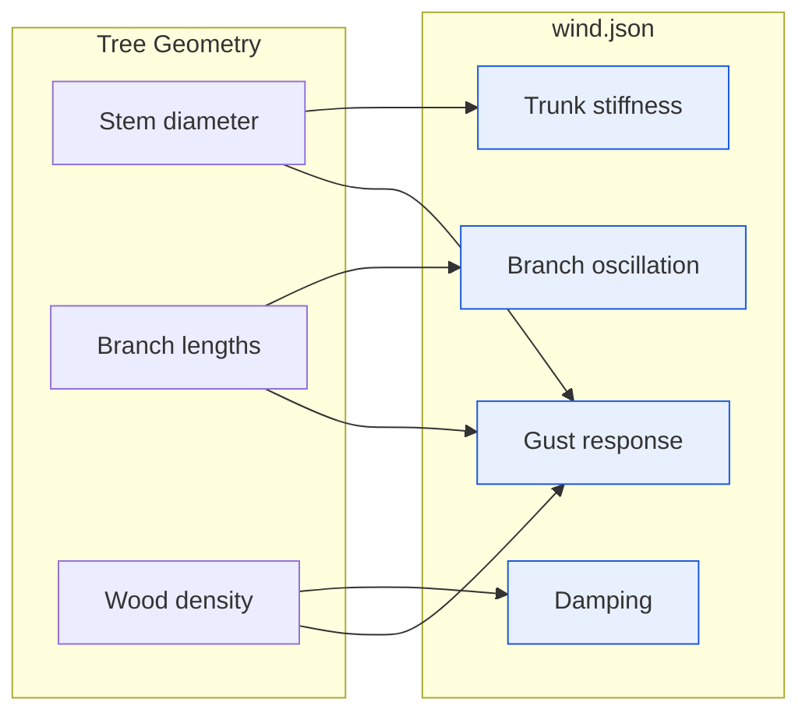
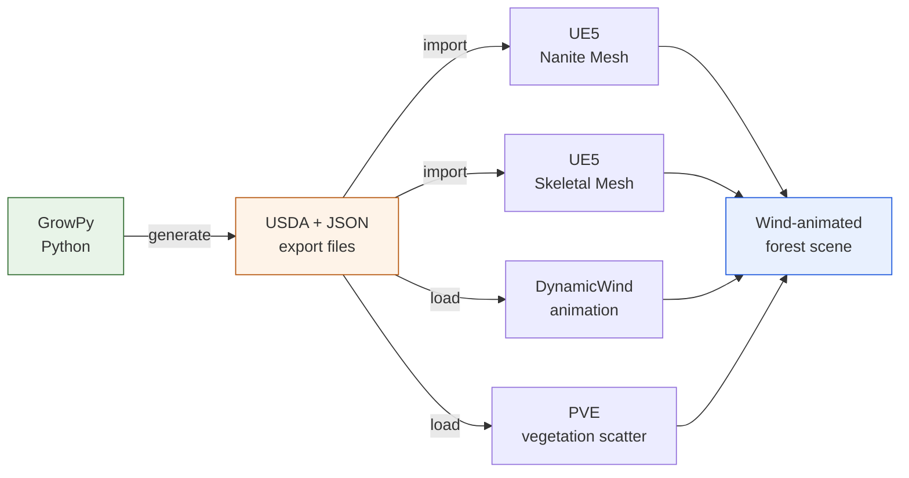

# PVE and Wind Integration -- Physics-Driven Trees in Unreal

**Connecting procedural trees to Unreal's Procedural Vegetation Editor**

---

## From static assets to living vegetation

With Nanite meshes and skeletons working, the next step was making trees behave
realistically inside Unreal Engine. This means two things: wind-driven animation
and seamless integration with Unreal's vegetation placement tools.

In mid-November 2025, we connected GrowPy's output to two Unreal systems:

1. **DynamicWind** -- a runtime wind animation system for skeletal meshes
2. **PVE (Procedural Vegetation Editor)** -- Unreal's tool for scattering and
   managing vegetation instances across landscapes

## Wind configuration export

Each tree variant now exports a `wind.json` file containing physics parameters
derived from the tree's actual geometry:

- **Trunk stiffness** scaled from the base diameter
- **Branch oscillation frequencies** tuned per branching level
- **Damping coefficients** that prevent unrealistic overshoot
- **Gust response curves** for natural-looking turbulence reaction

These values are not hand-tuned -- they are computed directly from the tree's
physical properties (stem diameter, branch lengths, wood density estimates).
A 4 m sapling responds differently from a 25 m mature tree because the
underlying geometry dictates the physics.

## PVE preset generation

The PVE system needs a JSON preset for each vegetation type that defines:

- Mesh references (Nanite static + skeletal variants)
- Collision profiles for gameplay interaction
- Foliage density and placement rules
- LOD transition distances
- Wind animation bindings

GrowPy now auto-generates these presets for every exported tree variant. Drop
the preset into Unreal and the tree is immediately available for landscape
painting with correct physics, collision, and rendering settings.

## Complete pipeline output

After this milestone, each tree variant produces a full package for Unreal:

| Output | Format | System |
|---|---|---|
| Nanite static mesh | USDA | Rendering |
| Skeletal mesh | USDA | Animation |
| Twig assembly | USDA | Foliage detail |
| Wind config | JSON | DynamicWind |
| PVE preset | JSON | Vegetation Editor |
| Bark + leaf textures | PNG | Materials |

This is the first time the full round-trip works: grow a tree in Python, export
everything, import into Unreal, and have a wind-animated, Nanite-rendered tree
placed via PVE -- all without manual intervention.

> **Screenshot placeholder** -- UE5 viewport showing a forest scene with
> PVE-scattered trees responding to wind, demonstrating the full round-trip
> from GrowPy to rendered scene.

<!-- TODO: add UE5 viewport screenshot of wind-animated forest scene -->

## Result

The export pipeline is now feature-complete for Unreal Engine integration.
Every tree GrowPy generates arrives in UE5 ready to render, animate, and scatter
across landscapes. The remaining challenge is scaling this to many species and
height variants -- which requires robust growth calibration.

---

*GrowPy -- procedural tree generation for virtual forest environments.*
