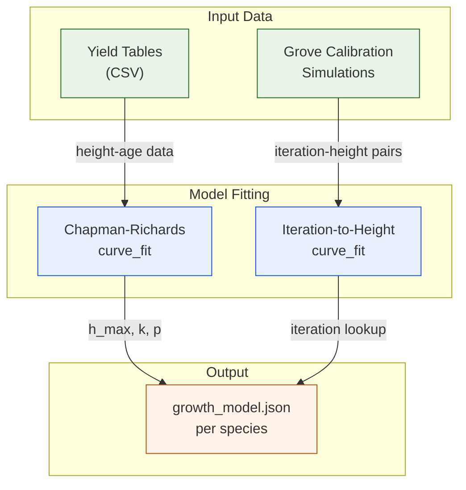
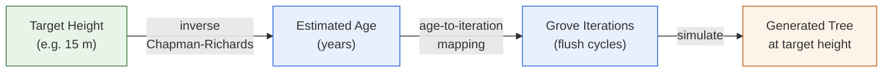

# Yield Table Calibration -- Real Forestry Data Drives Growth

**Linking The Grove's growth simulation to measured forest inventory data**

---

## The calibration problem

The Grove simulates tree growth through iterative "flush" cycles -- each cycle
extends branches, adds new shoots, and thickens stems. But flush cycles are
abstract units. To generate a tree at a specific real-world height (say, 15 m
European Beech in a competition stand), we need a mapping from target height
to the number of simulation iterations.

Without calibration, you can either guess the iteration count (inaccurate) or
run expensive trial-and-error simulations until the tree reaches the target
height (slow). Neither scales to 100+ tree variants.

## Yield tables as ground truth

Forestry yield tables are empirical datasets compiled from decades of forest
inventory measurements. They describe how tree height, diameter at breast height
(DBH), crown width, and stem volume develop over time for a given species and
site quality class.

We use yield tables as our calibration target:

- **Height-age curves** define expected height at each age
- **DBH-height relationships** let us validate stem dimensions
- **Site index classes** represent different growth conditions (roughly
  mapping to our competition vs. open-grown contexts)

## Chapman-Richards growth model

To bridge between yield table data and Grove iteration counts, we fit a
**Chapman-Richards growth function** for each species:

$$h(t) = h_{max} \cdot (1 - e^{-k \cdot t})^p$$

Where:
- $h(t)$ is the predicted height at age $t$
- $h_{max}$ is the asymptotic maximum height
- $k$ is the growth rate coefficient
- $p$ is the shape parameter

We fit $h_{max}$, $k$, and $p$ to the yield table data using non-linear
least squares. Then we fit a second function mapping Grove iteration counts
to simulated heights. The composition of these two functions gives us a direct
mapping: **target height -> Grove iterations**.

## Implementation (March 2026)

The calibration pipeline has three stages:

1. **Yield table parsing**: Read species-specific yield tables from CSV files
   (data from standard German forestry yield tables)
2. **Growth model fitting**: Fit Chapman-Richards parameters per species using
   `scipy.optimize.curve_fit`
3. **Iteration mapping**: Run calibration simulations at multiple iteration
   counts, fit a second curve mapping iterations to simulated height

> **Screenshot placeholder** -- calibration plot showing yield table data points,
> the fitted Chapman-Richards curve, and the iteration-to-height mapping for
> a representative species (e.g., European Beech).

<!-- TODO: add calibration curve plot (yield table points + fitted curve) -->

The result is a `growth_model.json` per species stored in
`data/assets/growth_models/`. Each file contains the fitted parameters and the
iteration-to-height lookup, so the generation pipeline can request "15 m beech"
and get the exact iteration count without any trial runs.

## The dual-function mapping

The key insight is composing two fitted functions:

## Yield tables for 10 species

We sourced yield tables for all 10 target species:

| Species | Source | Site Classes |
|---|---|---|
| European Beech | Schober 1995 | I, II, III |
| Norway Spruce | Assmann/Franz 1963 | I, II, III |
| Scots Pine | Wiedemann 1943 | I, II |
| European Oak | Juttner 1955 | I, II |
| Silver Birch | Schwappach 1903 | I, II |
| Common Ash | Wimmenauer 1919 | I, II |
| Silver Fir | Hausser 1956 | I, II |
| Small-leaved Linden | Schober 1995 | I, II |
| Sycamore Maple | Nagel 1985 | I, II |
| Wild Cherry | Lockow 2002 | I, II |

## Result

Every tree in the dataset is now grown to a precise target height based on
real forestry measurements. A "12 m Norway Spruce in competition" reflects the
actual stem proportions and crown dimensions that a forester would expect at
that development stage. This grounds the entire procedural pipeline in
empirical reality.

---

*GrowPy -- procedural tree generation for virtual forest environments.*
