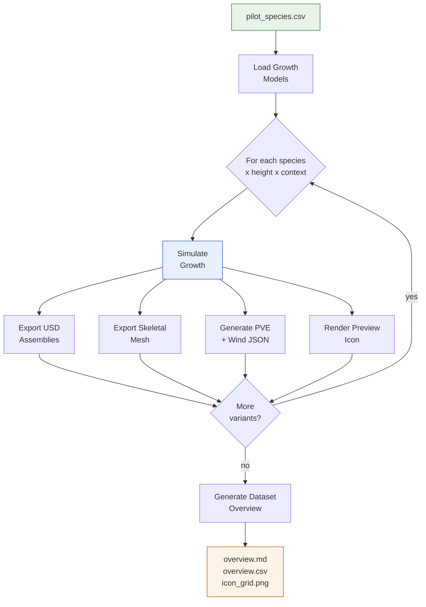
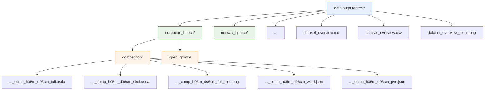

# Dataset Pipeline -- Automated Multi-Species Production

**From single-tree experiments to a scripted dataset factory**

---

## Scaling the problem

After nine months of building individual pipeline components -- growth simulation,
USD export, skeletal meshes, PVE integration, yield table calibration -- we had
everything needed to generate a single tree variant end-to-end. But the target
dataset requires **100 variants** (10 species x 2 contexts x 5 height steps).
Running these manually was not an option.

## The dataset pipeline

In late March 2026, we built `dataset_pipeline.py` -- a single CLI command that
orchestrates the full production run:

```
python src/growpy/cli/dataset_pipeline.py --all --steps 5
```

This command:



1. Reads the species list from `pilot_species.csv`
2. For each species, loads the calibrated growth model
3. Generates trees at each height step (5 m, 10 m, 15 m, 20 m, 25 m)
4. Runs both competition and open-grown contexts
5. Exports USD assemblies, skeletal meshes, PVE configs, and wind JSON
6. Renders preview icons for each variant
7. Generates a dataset overview with an icon grid

The pipeline handles failures gracefully -- if one species/height combination
fails (e.g., a height exceeding the species' biological maximum), it logs the
error and continues with the remaining variants.

## Output structure

Each species gets a clean directory hierarchy:



The naming convention encodes everything: species, context (comp/open), target
height, and actual DBH at that height. This makes it straightforward to find
and reference specific variants downstream.

## Dataset overview generation

The pipeline automatically produces three summary outputs:

- **Markdown overview** with embedded preview images for visual QA
- **CSV catalog** listing every variant with its parameters and file paths
- **Icon grid** compositing all preview images into a single PNG

These make it easy to verify the dataset at a glance and share progress
with the team without digging through individual files.

## Pilot run results

The first pilot run covered 2 species (European Beech, Norway Spruce) at
3 height steps (4 m, 8 m, 12 m), producing 12 complete tree variants.
Each variant includes stems, skeleton, twigs, textures, PVE config, and
preview icon -- confirming the full pipeline works end-to-end.

The path to 100 variants is now a matter of adding species configurations
and running the pipeline. No new code required -- just data.

> **Screenshot placeholder** -- terminal output showing a successful pipeline
> run with progress bars across multiple species and height steps.

<!-- TODO: add terminal screenshot of dataset_pipeline.py production run -->

---

*GrowPy -- procedural tree generation for virtual forest environments.*
